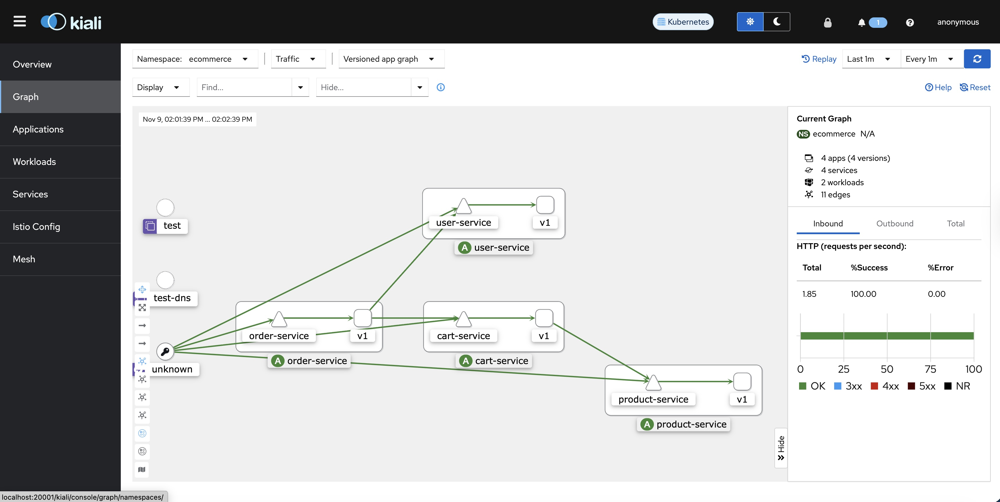
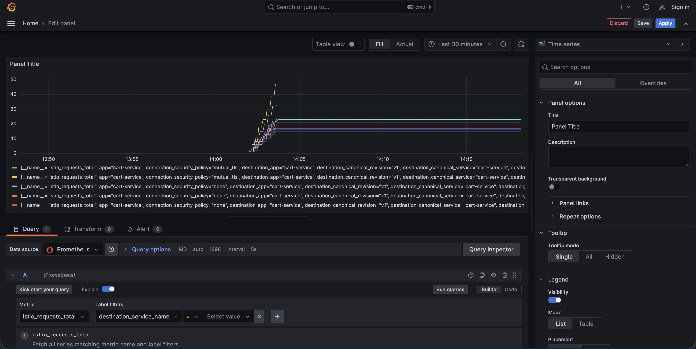
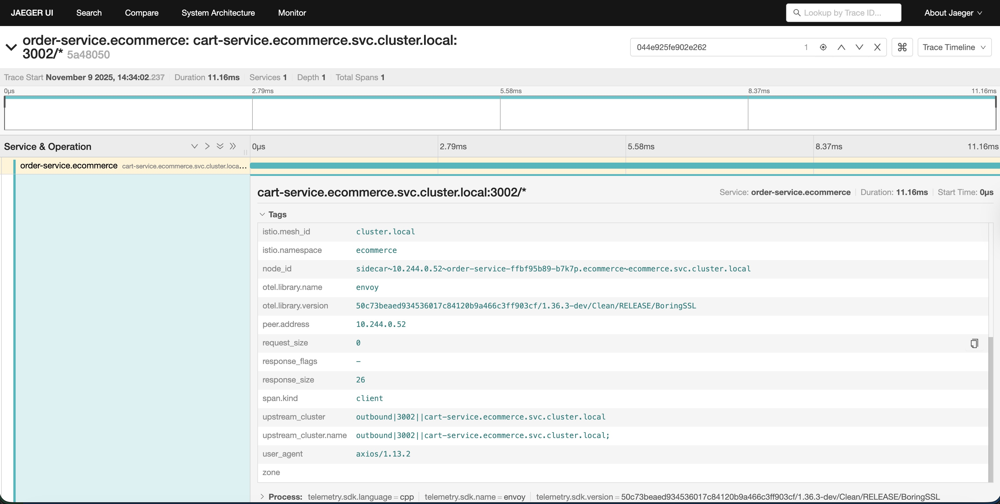

# Building a Production-Ready Microservices Architecture with Istio Service Mesh

## Introduction

In the world of microservices, managing service-to-service communication, observability, and security can quickly become overwhelming. Enter service mesh — a dedicated infrastructure layer that handles these concerns without requiring changes to your application code. In this article, I've captured my journey implementing an Istio service mesh for a microservices e-commerce application.

## What I Built

I created a complete microservices ecosystem with four distinct services:

- **Product Service** (Node.js): Manages product catalog with listings and details
- **Cart Service** (Node.js): Handles shopping cart operations and communicates with Product Service
- **User Service** (Node.js): Manages user information and profiles
- **Order Service** (Node.js): Processes orders by orchestrating Cart and User services

All services were containerized with Docker, deployed to Kubernetes (Minikube), and managed by Istio service mesh with full observability through Prometheus, Grafana, Jaeger, and Kiali.

## Why Service Mesh?

Before diving into the implementation, let me address the fundamental question: why use a service mesh?

In a microservices architecture, you face several challenges:

1. **Service Discovery**: How do services find and communicate with each other?
2. **Security**: How do you ensure encrypted communication between services?
3. **Observability**: How do you trace requests across multiple services?
4. **Traffic Management**: How do you implement canary deployments or A/B testing?
5. **Resilience**: How do you handle failures gracefully with retries and circuit breakers?

A service mesh solves all of these problems by injecting a sidecar proxy (Envoy) alongside each service instance. These proxies intercept all network traffic, enabling advanced features without touching your application code.

## The Learning Journey

### Phase 1: Building the Microservices

I started by building four simple but functional microservices in Node.js. Each service had:

- Health and readiness endpoints for Kubernetes probes
- RESTful APIs with proper error handling
- Environment-based configuration
- Structured logging for observability
- Dockerfiles for containerization

**Key Takeaway**: Keep services simple and focused. Each service should have a single responsibility and expose health checks for Kubernetes. I recommend uisong your native coding language to build these services. Initially, I got ambitious and impleted each service in different languages, python, golang, etc,. Context switching between languages was not worth it. I moved back to node.js. 

### Phase 2: Kubernetes Deployment

Before introducing Istio, I deployed all services to Minikube to verify basic functionality:

Each service got:
- A Deployment with 2 replicas for high availability
- A ClusterIP Service for internal communication
- Resource limits and requests for proper scheduling
- Liveness and readiness probes

**Key Takeaway**: Always test your services in Kubernetes without the service mesh first. This helps isolate issues when you add Istio later.

### Phase 3: Installing Istio

Installing Istio was surprisingly straightforward using Homebrew. The demo profile includes all Istio features and observability addons — perfect for learning.

**Understanding Istio Components:**

- **Istiod**: The control plane that manages and configures the Envoy proxies
- **Ingress Gateway**: The entry point for external traffic into the mesh
- **Egress Gateway**: Controls outbound traffic from the mesh

**Key Takeaway**: Istio has several installation profiles (minimal, default, demo, production). Choose the right one for your use case. The demo profile is great for learning but not for production.

### Phase 4: Sidecar Injection

The magic of Istio happens through sidecar injection. By labeling my namespace with `istio-injection=enabled`, Istio automatically injects an Envoy proxy container alongside each application pod:

```bash
# Enable automatic sidecar injection
kubectl label namespace ecommerce istio-injection=enabled

# Restart deployments to inject sidecars
kubectl rollout restart deployment -n ecommerce

# Verify - should see 2/2 containers (app + sidecar)
kubectl get pods -n ecommerce
```

Each pod now had two containers:
1. My application container
2. The `istio-proxy` (Envoy) container

**How It Works**: The Envoy proxy intercepts all inbound and outbound traffic using iptables rules. Your application thinks it's making direct HTTP calls, but the proxy transparently handles routing, security, and telemetry.

**Key Takeaway**: The sidecar pattern is powerful because it's completely transparent to your application. No code changes required!

### Phase 5: Observability — The Game Changer

This is where Istio truly shines. I installed four observability tools:

**1. Kiali — Service Mesh Visualization**

Kiali provides a real-time graph of your service mesh showing:
- Service dependencies and traffic flow
- Request rates and error rates
- Health status of each service
- Configuration validation

The visual graph immediately showed me how my services communicated, making it easy to spot bottlenecks and errors.


*Kiali's real-time service mesh visualization showing traffic flow and service health*

**2. Prometheus — Metrics Collection**

Prometheus automatically collects metrics from all Envoy proxies:
- Request rates
- Latency percentiles (P50, P90, P99)
- Error rates
- Connection pool statistics


*Prometheus metrics dashboard showing request rates and latency data*

**3. Grafana — Metrics Visualization**

Grafana comes with pre-built Istio dashboards:
- **Istio Service Dashboard**: Service-level metrics showing request rate, latency, and errors
- **Istio Workload Dashboard**: Pod-level performance metrics
- **Istio Mesh Dashboard**: Overall mesh health and performance
- **Istio Performance Dashboard**: Control plane and data plane overhead


*Grafana dashboard displaying Istio service metrics including latency and throughput*

**4. Jaeger — Distributed Tracing**

Jaeger provides end-to-end request tracing across services. When a request flows through Product Service → Cart Service → Order Service, Jaeger shows:
- The complete request path
- Time spent in each service
- Database queries and external API calls
- Where errors occurred


*Jaeger trace view showing end-to-end request flow across multiple microservices*

**Key Takeaway**: Observability isn't optional in microservices. Without these tools, debugging issues across distributed services is nearly impossible. Istio provides this out of the box.

## Key Learnings

### 1. Observability is Non-Negotiable

Without Kiali, Grafana, and Jaeger, debugging microservices is like flying blind. These tools show:
- Which services were slow
- Where errors originated
- How services depended on each other
- Performance bottlenecks

### 2. The Sidecar Pattern is Brilliant

Injecting a proxy alongside each pod means:
- No application code changes
- Consistent behavior across all services (regardless of language)
- Centralized policy enforcement
- Easy upgrades (just restart pods to get new proxy version)

### 3. Start Simple, Add Complexity Gradually

I followed this progression:
1. Build and test services locally
2. Deploy to Kubernetes without Istio
3. Add Istio with basic routing
4. Enable observability

Trying to do everything at once would have been overwhelming.

### 4. Resource Overhead is Real

Each Envoy sidecar consumes CPU and memory. In my setup:
- Product service pod: ~50MB memory, 10m CPU
- Istio proxy sidecar: ~100MB memory, 50m CPU

For larger deployments, this overhead multiplies. Consider this when planning capacity.

### 5. Configuration Validation Matters

Istio has many CRDs (Custom Resource Definitions): Gateway, VirtualService, DestinationRule, ServiceEntry, etc. Misconfiguration can break routing. Tools like Kiali help validate configurations.

### 6. Control Plane Performance

Istiod (the control plane) pushes configuration to all proxies. In large meshes with thousands of services, this can be a bottleneck. Monitor control plane performance in production.

## Common Pitfalls and How I Overcame Them

### Pitfall 1: Pods Not Getting Sidecars

**Problem**: After labeling the namespace, existing pods didn't get sidecars.

**Solution**: Sidecar injection only happens at pod creation time. You must restart deployments:

```bash
kubectl rollout restart deployment -n ecommerce
```

### Pitfall 2: Observability Tools Not Showing Data

**Problem**: Kiali and Grafana showed no data initially.

**Solution**: Generate traffic! The observability tools need active requests to display metrics. I created a load generator pod:

```bash
kubectl run load-generator --image=curlimages/curl --namespace ecommerce -- sleep 3600
```

Then ran a continuous traffic loop from inside that pod.

## Conclusion

Implementing Istio taught me that modern microservices architectures require a service mesh to be production-ready. The ability to add observability, security, and resilience without touching application code is transformative.

If you're building microservices and struggling with service communication, observability, or security, I highly recommend exploring Istio. The initial learning curve is worth the operational benefits.

The complete code and configurations for this project are available in my GitHub repository. [service-mesh-implementation](https://github.com/naviprem/project-05-service-mesh-implementation/tree/main) Feel free to clone it and experiment!

**What challenges have you faced with microservices? Have you used a service mesh? Share your experiences in the comments!**

---

*This article is part of my Kubernetes learning journey. Follow me for more hands-on tutorials on cloud-native technologies, DevOps practices, and distributed systems.*
